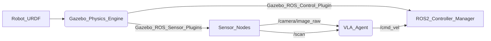

# Chapter 3: ROS 2 Tools: Rviz, Gazebo, and the CLI

### 🎯 Objective
This chapter equips you with the essential toolkit for ROS 2 development. You will learn to visualize robot data using **Rviz2**, simulate physics and environments with **Gazebo**, and master the command-line interface (CLI) for rapid debugging and introspection. These tools are indispensable for diagnosing issues that arise in the complex transition from code to physical motion.

### 🧠 Theory: Visualization vs. Simulation
It's crucial to distinguish between two primary tools that often look similar but serve vastly different purposes:

*   **Rviz2 (Robot Visualization):** This is a "window" into what the robot *thinks* is happening. It visualizes sensor data, internal state estimates, and planned paths. If Rviz shows the robot facing a wall, but the physical robot is in an open room, your localization is broken. Rviz *displays* reality (as perceived by the robot).
*   **Gazebo (Robot Simulation):** This creates a *fake reality*. It solves physics equations to simulate gravity, friction, and collisions. It generates synthetic sensor data that mimics what a real robot would see. Gazebo *substitutes* reality.

### 🛠️ Rviz2: Seeing what the Robot Sees
Rviz2 subscribes to topics (like `/scan`, `/camera/image_raw`, `/tf`) and renders them in 3D space.

**Launching Rviz2:**
```bash
# Before running any ROS 2 command, ensure your environment is sourced.
# Replace <ros2_install_path> with your ROS 2 installation path (e.g., /opt/ros/humble)
source <ros2_install_path>/setup.bash

# Example: Launch Rviz without a specific config (starts with an empty view)
ros2 run rviz2 rviz2

# Example: Launch Rviz with a pre-configured display file
# This assumes you have an .rviz configuration file, e.g., in your robot's package.
# For instance, if you have a package `my_robot_description` and an rviz folder inside it:
ros2 run rviz2 rviz2 -d install/my_robot_description/share/my_robot_description/rviz/robot_display.rviz
```

**Configuring a Basic Display:**

Once Rviz is open, you can add displays:
1.  **Add button**: Click the 'Add' button in the 'Displays' panel.
2.  **Display Type**: Select the type of data you want to visualize (e.g., `RobotModel`, `LaserScan`, `Image`, `TF`).
3.  **Topic**: For sensor data, specify the ROS 2 topic it's published on (e.g., `/camera/color/image_raw`, `/scan`).
4.  **Fixed Frame**: Set the 'Fixed Frame' (usually `map`, `odom`, or `base_link`) in the 'Global Options' to provide a reference point for all visualizations.

Here’s an example of a simple ROS 2 Python node that publishes a `String` message to a topic, which can then be visualized in Rviz using the `Text` display:

```python
# File: /home/abdullahiqbal/Abdullah/hackathon-book-project/src/my_robot_nodes/my_robot_nodes/simple_publisher.py
import rclpy
from rclpy.node import Node
from std_msgs.msg import String # Standard ROS 2 String message type
from geometry_msgs.msg import PoseStamped # For Rviz Text display position

class SimplePublisher(Node):
    """
    A simple ROS 2 node that publishes a string message periodically.
    This message can be visualized in Rviz using the 'Text' display type.
    """
    def __init__(self):
        super().__init__('simple_publisher')
        # Declare a parameter for the text message, with a default value
        self.declare_parameter('text_message', 'Hello, Physical AI!')
        self.message_to_publish = self.get_parameter('text_message').get_parameter_value().string_value

        # Create a publisher for String messages on the '/robot_status_text' topic
        # QoS profile 'Reliable' ensures all messages are delivered, suitable for critical status.
        self_publisher = self.create_publisher(String, '/robot_status_text', 10)
        self_pose_publisher = self.create_publisher(PoseStamped, '/robot_status_pose', 10)

        # Timer to publish the message every 0.5 seconds (2 Hz)
        self_timer = self.create_timer(0.5, self.timer_callback)
        self.get_logger().info(f'SimplePublisher node started, publishing "{self.message_to_publish}" to /robot_status_text')

    def timer_callback(self):
        """
        Callback function for the timer, publishes the string message and its pose.
        """
        msg = String()
        msg.data = self.message_to_publish
        self_publisher.publish(msg)

        pose_msg = PoseStamped()
        pose_msg.header.stamp = self.get_clock().now().to_msg()
        pose_msg.header.frame_id = "base_link"  # Or your robot's base frame
        pose_msg.pose.position.x = 0.0
        pose_msg.pose.position.y = 0.0
        pose_msg.pose.position.z = 1.0 # Position above the robot
        self_pose_publisher.publish(pose_msg)

        # self.get_logger().info(f'Published: "{msg.data}"')

def main(args=None):
    rclpy.init(args=args)
    simple_publisher = SimplePublisher()
    rclpy.spin(simple_publisher)
    simple_publisher.destroy_node()
    rclpy.shutdown()

if __name__ == '__main__':
    main()

# To build this node, add the following to your setup.py in the my_robot_nodes package:
# entry_points={
#     'console_scripts': [
#         'simple_publisher = my_robot_nodes.simple_publisher:main',
#     ],
# },
```

### ⚠️ Common Pitfalls (Sim vs. Real)
*   **Simulation**: In Isaac Sim or Gazebo, sensor data is often perfect, without noise, latency, or dropouts. The TF tree is always consistent. This can lead to a "happy path" where your algorithms appear robust.
*   **Reality**: Real sensors introduce noise, glare, motion blur (especially with cameras during rapid movement), latency, and occasional data corruption. The TF tree can become inconsistent due to delayed joint state updates or IMU drift. A robot that looks perfectly localized in sim might drift significantly in reality.
*   **Fix**:
    *   **Noise**: Implement filtering (e.g., Kalman filters) on sensor data.
    *   **Latency**: Monitor message timestamps (`ros2 topic echo /topic --full-messages`) and use QoS profiles (`Best Effort` for sensor data where some loss is acceptable for lower latency). Ensure your processing pipeline has minimal overhead.
    *   **TF Consistency**: Regularly check the TF tree health using `ros2 run rqt_tf_tree rqt_tf_tree`. Implement robust error handling for TF lookups.

### 🧪 Verification
After launching Rviz and your robot/sensor nodes:

```bash
# Check available topics to ensure your publishers are active
ros2 topic list

# Echo a sensor topic to inspect its raw data (e.g., laser scan)
ros2 topic echo /scan -n 1 --full-messages

# Verify the TF tree in Rviz, ensuring all frames are connected and transforms are valid.
# In Rviz, add a 'TF' display to visualize the coordinate frames.
```

## Gazebo: Simulating Reality

### 🎯 Objective
Learn to use Gazebo for physics-driven simulation of robotic systems, understanding its role as a critical proving ground before real-world deployment.

### 🧠 Theory: Physics-Driven Robot Simulation
Gazebo is a powerful 3D simulator that accurately models real-world physics, allowing you to develop and test robotics algorithms in a safe, repeatable, and cost-effective virtual environment. For embodied AI, Gazebo isn't just a visualization tool; it's a predictive engine. It simulates gravity, friction, collisions, and sensor phenomena, giving you crucial insights into how your code will interact with the physical world. This is where you test if your robot falls over when commanded to move, if its grippers can hold objects, or if its navigation stack avoids obstacles. Gazebo typically demands significant **workstation (RTX 4090)** resources, especially for complex environments, high-fidelity sensors, and multiple robots. While it can run on **Jetson Orin Nano / Robot CPU** for simpler scenarios, performance constraints (like low simulation update rates or degraded sensor output) become critical. A slow simulation rate means your "real-time" control loops are not truly being tested under the same time constraints as the physical robot.

### 🛠️ Architecture
Gazebo interacts with ROS 2 through dedicated plugins (e.g., `gazebo_ros_pkgs`). These plugins bridge the simulated world's physics and sensor data to ROS 2 topics, and conversely, allow ROS 2 commands (like motor control) to influence the simulated robot.



### 💻 Implementation
Launching Gazebo typically involves a `ros2 launch` file that loads a specific world (e.g., an empty world or a world with obstacles) and spawns your robot model (defined by a URDF or SDF file).

```bash
# Before running any ROS 2 command, ensure your environment is sourced.
source <ros2_install_path>/setup.bash

# Launch an empty Gazebo world (Gazebo Sim, formerly Gazebo Garden/Fortress)
ros2 launch gazebo_ros gazebo.launch.py

# Launch Gazebo with a specific robot model (e.g., from 'my_robot_description' package)
# This example assumes you have a launch file in your robot description package
# that launches Gazebo and spawns your robot (often using 'spawn_entity.py').
ros2 launch my_robot_description display.launch.py model:=src/my_robot_description/urdf/my_robot.urdf.xacro
```

**Spawning a Robot Manually (for quick testing):**

You can also spawn a robot model into an already running Gazebo instance using the `spawn_entity.py` script:

```bash
# Assuming Gazebo is already running
# Replace my_robot_description with your package name and my_robot.urdf with your URDF file
ros2 run gazebo_ros spawn_entity.py -entity my_robot -file install/my_robot_description/share/my_robot_description/urdf/my_robot.urdf -x 0.0 -y 0.0 -z 0.5
```

### ⚠️ Common Pitfalls (Sim vs. Real)
*   **Simulation**:
    *   **Perfect Physics**: Gazebo's physics engine is an approximation. Friction coefficients, damping, and collision dynamics might not perfectly match the real world.
    *   **Ideal Sensors**: Simulated sensors are often ideal, lacking real-world imperfections like lens distortion, lighting variations, or EMI noise.
    *   **Infinite Resources**: The simulation often runs on a powerful workstation, not mirroring the limited computational resources of an **Edge Device (Jetson Orin / Robot CPU)**.
*   **Reality**:
    *   **Physics Mismatch**: Even small discrepancies between simulated and real physics can cause control systems to fail (e.g., a robot slipping unexpectedly).
    *   **Sensor Imperfections**: Real sensor data requires robust processing (noise reduction, calibration, outlier rejection).
    *   **Resource Constraints**: Code that runs smoothly in a high-fidelity simulation might introduce unacceptable latency or fail due to memory limits on an edge device.
*   **Fix**:
    *   **Iterative Refinement**: Calibrate simulation parameters (friction, mass) against real-world observations.
    *   **Add Noise**: Introduce realistic noise models to simulated sensor data to make your algorithms more robust.
    *   **Profile Performance**: Measure the latency and resource usage of your ROS nodes in both simulation and on the target **Edge Device**. Optimize critical loops for low latency (&lt;100ms for motor control).

:::danger
**Hardware Impact**: Running computationally intensive Gazebo simulations on an **Edge Device (Jetson Orin)** without proper resource management can lead to **thermal throttling** and significant **frame rate drops**, severely impacting the real-time performance of your robot control software.
:::

### 📝 Chapter Summary
*   **Rviz2** is your primary visualization tool. It shows you the robot's *internal belief* of the world—its position, the map it has built, and the sensor data it is receiving. It is essential for debugging logic errors and perception issues.
*   **Gazebo** is your physics simulator. It replaces the physical world, allowing you to test dangerous or complex behaviors (like falling) without risking expensive hardware.
*   The **ROS 2 CLI** (Command Line Interface) provides rapid introspection. Tools like `ros2 topic`, `ros2 node`, and `ros2 service` allow you to check the pulse of your system in real-time.
*   Simulation is a powerful accelerator, but it is an approximation. The transition from Gazebo to a physical robot will always reveal unmodeled physics and sensor noise.

### 🔚 Conclusion
You now possess the "Eyes" (Rviz) and the "Holodeck" (Gazebo) of robotics development. These tools allow you to see the invisible data streams flowing through your robot and to test your code in safety. But remember, a simulation is only as good as its physics model. As we proceed to perception and control, we will constantly refer back to these tools to verify that our code is behaving as expected before we let it move a single atom in the real world.
