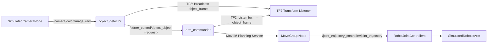

# Project 2: Visual Sorter Arm – Object Identification and Sorting

### 🎯 Objective
Students will implement a ROS 2-based robotic arm system that identifies colored objects using OpenCV, transforms their coordinates using TF2, and sorts them into designated bins using MoveIt 2 for arm control in a simulated environment.

### 🧠 Theory: Embodied Perception-Action Loop
In this project, we bridge the abstract world of computer vision with the physical reality of robot manipulation. The "Visual Sorter Arm" exemplifies an embodied perception-action loop:
1.  **Perception**: A camera (simulated) captures raw pixel data. The `object_detector` node processes this data to identify colored objects. This is analogous to a robot's "eyes."
2.  **Cognition/Planning**: The `object_detector` then broadcasts the detected object's position in a standardized `object_frame` using TF2. The `arm_commander` node subscribes to this information, transforms it into the robot's base frame, and plans a grasp trajectory using MoveIt 2. This is the robot's "brain" deciding how to act.
3.  **Action**: MoveIt 2 generates a series of joint commands that are then sent to the robot's (simulated) joint controllers, causing the arm to physically move and sort the object. This is the robot's "muscles."

The success of this loop critically depends on low-latency perception, accurate coordinate transformations, and robust motion planning. Any delay or error in one stage can lead to a cascading failure, from missed detections to unintended collisions. The Quality of Service (QoS) for each ROS topic becomes paramount: sensor data might tolerate `Best Effort` for speed, while control commands absolutely require `Reliable` delivery for safety and precision.

### 🛠️ Architecture
The system comprises three main ROS 2 nodes: a simulated camera publisher (often part of the simulation environment), an `object_detector` node, and an `arm_commander` node, interacting via topics and services.



**ROS 2 Graph Explanation:**
*   **`SimulatedCameraNode`**: This node (often provided by Gazebo/Isaac Sim) publishes raw camera images on `/camera/color/image_raw`.
*   **`object_detector`**: Subscribes to `/camera/color/image_raw`, performs image processing (color segmentation), identifies object centroids, and then broadcasts a `tf2` transform for each detected object (`object_frame`). It also exposes a ROS 2 service `/sorter_control/detect_object` that `arm_commander` will call.
*   **`arm_commander`**: Acts as the orchestrator. It calls the `object_detector` service to trigger detection, listens for the `object_frame` via `tf2`, uses MoveIt 2 Python bindings to plan and execute pick-and-place trajectories, and sends commands to the `MoveGroupNode`.
*   **`MoveGroupNode`**: This is a core MoveIt 2 component that provides motion planning services.
*   **`RobotJointControllers`**: Receives joint trajectory commands from MoveIt 2 and controls the simulated robot arm's joints.
*   **`SimulatedRoboticArm`**: The physical representation of the arm within the simulation environment.

### 💻 Implementation

The project will be organized into a ROS 2 package, typically named `visual_sorter_arm`.

**File Structure (Illustrative):**

```bash
/home/abdullahiqbal/Abdullah/hackathon-book-project/src/visual_sorter_arm
├── visual_sorter_arm
│   ├── __init__.py
│   ├── object_detector.py
│   └── arm_commander.py
├── srv
│   └── SorterControl.srv
├── launch
│   └── sorter_bringup.launch.py
├── config
│   └── sorter_moveit_config.yaml
└── package.xml
└── setup.py
```

#### 1. Defining the Custom Service: `SorterControl.srv`
This service will be used by `arm_commander` to request object detection from `object_detector`.

**Context**: `/home/abdullahiqbal/Abdullah/hackathon-book-project/src/visual_sorter_arm/srv/SorterControl.srv`

```
---
bool success # true if object detected and transform broadcasted, false otherwise
geometry_msgs/msg/Point object_position # Position of the detected object in camera frame
string object_color # Color of the detected object
```
**Explanation**:
*   The `---` separates the request and response fields. In this case, there's no explicit request field; the call itself triggers detection.
*   The response includes a `success` boolean, the `object_position` (in the camera's frame), and the `object_color`.

#### 2. `object_detector.py`: Perceiving the World
This node will perform color-based segmentation and broadcast the object's pose.

**Context**: `/home/abdullahiqbal/Abdullah/hackathon-book-project/src/visual_sorter_arm/visual_sorter_arm/object_detector.py`

```python
import rclpy
from rclpy.node import Node
from sensor_msgs.msg import Image
from cv_bridge import CvBridge
import cv2
import numpy as np
import tf2_ros
import geometry_msgs.msg
from visual_sorter_arm_interfaces.srv import SorterControl # Assuming interface package

class ObjectDetector(Node):
    def __init__(self):
        super().__init__('object_detector')
        self.bridge = CvBridge()
        self.image_subscription = self.create_subscription(
            Image,
            '/camera/color/image_raw',
            self.image_callback,
            rclpy.qos.qos_profile_sensor_data # Best Effort for sensor data
        )
        self.tf_broadcaster = tf2_ros.TransformBroadcaster(self)
        self.service = self.create_service(
            SorterControl,
            'sorter_control/detect_object',
            self.detect_object_callback
        )
        self.latest_image = None
        self.get_logger().info('Object Detector Node has been started.')

    def image_callback(self, msg):
        self.latest_image = msg

    def detect_object_callback(self, request, response):
        if self.latest_image is None:
            self.get_logger().warn("No image received yet.")
            response.success = False
            return response

        try:
            cv_image = self.bridge.imgmsg_to_cv2(self.latest_image, "bgr8")
        except Exception as e:
            self.get_logger().error(f"Error converting image: {e}")
            response.success = False
            return response

        # --- Color Segmentation (Example for a red object) ---
        hsv_image = cv2.cvtColor(cv_image, cv2.COLOR_BGR2HSV)
        # Define range for red color (adjust as needed for your objects)
        lower_red1 = np.array([0, 100, 100])
        upper_red1 = np.array([10, 255, 255])
        lower_red2 = np.array([170, 100, 100])
        upper_red2 = np.array([180, 255, 255])

        mask1 = cv2.inRange(hsv_image, lower_red1, upper_red1)
        mask2 = cv2.inRange(hsv_image, lower_red2, upper_red2)
        red_mask = mask1 + mask2

        # Find contours
        contours, _ = cv2.findContours(red_mask, cv2.RETR_EXTERNAL, cv2.CHAIN_APPROX_SIMPLE)

        if contours:
            # Assume the largest contour is our object
            largest_contour = max(contours, key=cv2.contourArea)
            M = cv2.moments(largest_contour)
            if M["m00"] > 0:
                cx = int(M["m10"] / M["m00"])
                cy = int(M["m01"] / M["m00"])

                # --- Approximate 3D position (very basic example, depends on camera intrinsics) ---
                # In a real scenario, you'd use depth camera data or camera intrinsics to get Z.
                # For simulation, we might assume a fixed Z or use known object height.
                # This is a placeholder for actual depth calculation.
                # For this example, let's just make up a 'z' value relative to the camera.
                # In simulation, you might have access to depth images or direct object poses.
                # For simplicity, we'll assume a known object plane for rough estimation.
                # A more robust solution involves camera intrinsics and depth images.
                approx_z_distance = 0.5 # meters, example fixed distance from camera

                # These need to be properly calculated based on camera FOV and intrinsics
                # For this guide, we'll use placeholder values.
                # Actual calculations would involve:
                # fx, fy, cx, cy = camer-info.k[0], camer-info.k[4], camer-info.k[2], camer-info.k[5]
                # x_camera = (cx_pixel - cx) * depth / fx
                # y_camera = (cy_pixel - cy) * depth / fy

                # Placeholder for X, Y in camera frame, assuming simple mapping
                # These are NOT real-world accurate, just for demonstration
                x_camera = (cx - cv_image.shape[1] / 2) * 0.001 # rough pixel to meter scale
                y_camera = (cy - cv_image.shape[0] / 2) * 0.001 # rough pixel to meter scale

                object_point_camera = geometry_msgs.msg.Point()
                object_point_camera.x = approx_z_distance # x-forward in camera frame for RealSense
                object_point_camera.y = -x_camera # y-left
                object_point_camera.z = -y_camera # z-up


                # --- Broadcast TF2 Transform ---
                t = geometry_msgs.msg.TransformStamped()
                t.header.stamp = self.get_clock().now().to_msg()
                t.header.frame_id = self.latest_image.header.frame_id # Parent frame (e.g., 'camera_link')
                t.child_frame_id = "detected_object_frame"
                t.transform.translation.x = object_point_camera.x
                t.transform.translation.y = object_point_camera.y
                t.transform.translation.z = object_point_camera.z
                t.transform.rotation.x = 0.0 # No rotation for now, assume upright
                t.transform.rotation.y = 0.0
                t.transform.rotation.z = 0.0
                t.transform.rotation.w = 1.0 # Identity quaternion
                self.tf_broadcaster.sendTransform(t)

                self.get_logger().info(f"Detected object at ({object_point_camera.x:.2f}, {object_point_camera.y:.2f}, {object_point_camera.z:.2f}) in camera frame.")

                response.success = True
                response.object_position = object_point_camera
                response.object_color = "red" # For now, hardcode detected color
            else:
                self.get_logger().info("No significant red object found.")
                response.success = False
        else:
            self.get_logger().info("No red objects detected.")
            response.success = False

        return response

def main(args=None):
    rclpy.init(args=args)
    object_detector = ObjectDetector()
    rclpy.spin(object_detector)
    object_detector.destroy_node()
    rclpy.shutdown()

if __name__ == '__main__':
    main()

# setup.py entry point (add to your setup.py in 'entry_points' section):
# 'visual_sorter_arm = visual_sorter_arm.object_detector:main',
```

**Physical Context `object_detector.py`**:
*   **Target**: This code, especially the OpenCV part, runs on the main CPU. If integrated with a camera driver, it would typically run on the robot's onboard computer (e.g., Jetson Orin Nano).
*   **Constraint**: The frame rate of the camera image topic and the processing time for `cv2.inRange` and `cv2.findContours` are critical. If `object_detector` cannot keep up with the camera's frame rate, it will fall behind, leading to outdated object poses.
*   **QoS**: `rclpy.qos.qos_profile_sensor_data` is used for the image subscription, which is typically `Best Effort` to prioritize fresh data over guaranteed delivery, reducing latency for perception. This is crucial for a responsive perception-action loop.

#### 3. `arm_commander.py`: Acting on Perception
This node will utilize MoveIt 2 to plan and execute arm movements.

**Context**: `/home/abdullahiqbal/Abdullah/hackathon-book-project/src/visual_sorter_arm/visual_sorter_arm/arm_commander.py`

```python
import rclpy
from rclpy.node import Node
import moveit_commander
import moveit_msgs.msg
import geometry_msgs.msg
import tf2_ros
from tf2_ros import LookupException, ConnectivityException, ExtrapolationException
from visual_sorter_arm_interfaces.srv import SorterControl # Assuming interface package
import sys
import time

class ArmCommander(Node):
    def __init__(self):
        super().__init__('arm_commander')

        # Initialize MoveIt! Commander
        # Note: moveit_commander.roscpp_initialize(sys.argv) is for ROS 1.
        # For ROS 2, it's integrated with rclpy.init(), and MoveIt! Commander
        # works by setting up the node in the background.
        moveit_commander.roscpp_initialize(sys.argv) # This needs to be called to initialize internal ROS 2 components for MoveIt
        self.robot = moveit_commander.RobotCommander(node_name='arm_commander_moveit')
        self.scene = moveit_commander.PlanningSceneInterface(synchronous=True, node_name='arm_commander_moveit')
        self.group_name = "arm" # Replace with your MoveIt! planning group name
        self.move_group = moveit_commander.MoveGroupCommander(self.group_name, node_name='arm_commander_moveit')

        # Display trajectory publisher
        self.display_trajectory_publisher = self.create_publisher(
            moveit_msgs.msg.DisplayTrajectory,
            '/move_group/display_planned_path',
            10 # QoS depth
        )

        # TF2 Buffer and Listener
        self.tf_buffer = tf2_ros.Buffer()
        self.tf_listener = tf2_ros.TransformListener(self.tf_buffer, self)

        # Object Detector Service Client
        self.sorter_service_client = self.create_client(
            SorterControl,
            'sorter_control/detect_object'
        )
        while not self.sorter_service_client.wait_for_service(timeout_sec=1.0):
            self.get_logger().info('Object Detector service not available, waiting...')

        self.get_logger().info('Arm Commander Node has been started.')

    def call_object_detector_service(self):
        self.get_logger().info("Calling object detector service...")
        request = SorterControl.Request()
        future = self.sorter_service_client.call_async(request)
        rclpy.spin_until_future_complete(self, future)
        return future.result()

    def go_to_pose(self, pose_goal):
        self.move_group.set_pose_target(pose_goal)
        plan = self.move_group.plan()

        if plan and plan[1].joint_trajectory.points: # Check if plan is not empty and has points
            self.get_logger().info("Planning successful. Executing motion...")
            self.move_group.execute(plan[1], wait=True)
            self.move_group.stop() # Ensure no residual movement
            self.move_group.clear_pose_targets()
            return True
        else:
            self.get_logger().warn("Motion planning failed.")
            return False

    def pick_and_place(self):
        # 1. Go to pre-grasp pose (e.g., home position or above the table)
        # This should be defined as a named pose in your SRDF or calculated.
        self.move_group.set_named_target("home") # Assuming 'home' is a defined pose
        self.move_group.go(wait=True)
        self.move_group.stop()
        self.move_group.clear_pose_targets()

        # 2. Call the object detector service
        response = self.call_object_detector_service()

        if response.success:
            self.get_logger().info(f"Object detected: {response.object_color} at {response.object_position}")

            # --- TF2: Transform object_frame to base_link ---
            try:
                # Wait for the transform to become available
                # It's crucial that object_detector is broadcasting frequently
                t_stamped = self.tf_buffer.lookup_transform(
                    self.move_group.get_planning_frame(), # Target frame, typically 'base_link'
                    "detected_object_frame", # Source frame
                    rclpy.time.Time() # Get the latest transform
                )
                self.get_logger().info(f"Transform received from {t_stamped.header.frame_id} to {t_stamped.child_frame_id}")

                object_pose_base = geometry_msgs.msg.Pose()
                object_pose_base.position.x = t_stamped.transform.translation.x
                object_pose_base.position.y = t_stamped.transform.translation.y
                object_pose_base.position.z = t_stamped.transform.translation.z
                object_pose_base.orientation = t_stamped.transform.rotation

                self.get_logger().info(f"Object in base_link frame: {object_pose_base.position}")

                # 3. Plan grasp pose (above object, then down to object)
                # Define offset for pre-grasp (above the object)
                pre_grasp_offset = 0.15 # 15 cm above object
                grasp_offset = 0.05 # 5 cm from object for gripper

                # Pre-grasp pose
                pre_grasp_pose = geometry_msgs.msg.Pose()
                pre_grasp_pose.position.x = object_pose_base.position.x
                pre_grasp_pose.position.y = object_pose_base.position.y
                pre_grasp_pose.position.z = object_pose_base.position.z + pre_grasp_offset
                pre_grasp_pose.orientation.w = 1.0 # Assuming simple approach from top

                # Grasp pose
                grasp_pose = geometry_msgs.msg.Pose()
                grasp_pose.position.x = object_pose_base.position.x
                grasp_pose.position.y = object_pose_base.position.y
                grasp_pose.position.z = object_pose_base.position.z + grasp_offset
                grasp_pose.orientation.w = 1.0 # Assuming simple approach from top

                # Move to pre-grasp
                if self.go_to_pose(pre_grasp_pose):
                    self.get_logger().info("Reached pre-grasp pose.")
                    # Move to grasp
                    if self.go_to_pose(grasp_pose):
                        self.get_logger().info("Reached grasp pose. Gripping object...")
                        # TODO: Add gripper open/close logic here (publish to gripper topic)
                        time.sleep(1.0) # Simulate gripper closing

                        # 4. Lift object
                        lift_pose = geometry_msgs.msg.Pose()
                        lift_pose.position.x = grasp_pose.position.x
                        lift_pose.position.y = grasp_pose.position.y
                        lift_pose.position.z = grasp_pose.position.z + pre_grasp_offset
                        lift_pose.orientation.w = 1.0
                        if self.go_to_pose(lift_pose):
                            self.get_logger().info("Lifted object.")

                            # 5. Move to sorting bin location (example for 'red' bin)
                            # Define bin locations as named poses or fixed coordinates
                            if response.object_color == "red":
                                self.move_group.set_named_target("red_bin_pose") # Assuming 'red_bin_pose' is defined
                                if self.move_group.go(wait=True):
                                    self.get_logger().info("Reached red bin. Releasing object...")
                                    # TODO: Add gripper open/close logic here
                                    time.sleep(1.0) # Simulate gripper opening
                                    return_pose = geometry_msgs.msg.Pose()
                                    return_pose.position.x = self.move_group.get_current_pose().pose.position.x
                                    return_pose.position.y = self.move_group.get_current_pose().pose.position.y
                                    return_pose.position.z = self.move_group.get_current_pose().pose.position.z + pre_grasp_offset # Move up after release
                                    return_pose.orientation.w = 1.0
                                    self.go_to_pose(return_pose) # Lift slightly after release
                                    self.get_logger().info("Object released.")
                            else:
                                self.get_logger().warn(f"No bin defined for color: {response.object_color}")

                # 6. Return to home or ready position
                self.move_group.set_named_target("home")
                self.move_group.go(wait=True)
                self.move_group.stop()
                self.move_group.clear_pose_targets()

            except (LookupException, ConnectivityException, ExtrapolationException) as ex:
                self.get_logger().error(f"TF2 transform error: {ex}")
            except Exception as e:
                self.get_logger().error(f"An error occurred during pick and place: {e}")
        else:
            self.get_logger().info("No object detected or service failed.")

def main(args=None):
    rclpy.init(args=args)
    arm_commander = ArmCommander()
    # For demonstration, we can trigger the pick and place loop here
    try:
        while rclpy.ok():
            arm_commander.pick_and_place()
            time.sleep(5) # Wait before next sorting attempt
    except KeyboardInterrupt:
        pass
    finally:
        arm_commander.destroy_node()
        moveit_commander.roscpp_shutdown() # Clean up MoveIt! Commander
        rclpy.shutdown()

if __name__ == '__main__':
    main()

# setup.py entry point (add to your setup.py in 'entry_points' section):
# 'arm_commander = visual_sorter_arm.arm_commander:main',
```

**Physical Context `arm_commander.py`**:
*   **Target**: This node, due to MoveIt 2's computational demands (motion planning, collision checking), generally requires a more powerful CPU, likely running on a workstation for simulation. In a real-world scenario on a Jetson Orin, performance optimization and reduced planning complexity would be crucial.
*   **Constraint**: Motion planning latency is critical. If planning takes too long, the perception data might become stale, leading to movements based on outdated object positions. TF2 lookup latency is also a factor; waiting for transforms adds delay.
*   **Safety**: Incorrectly planned movements or unexpected collisions are a major risk, even in simulation. The `go_to_pose` function includes `move_group.stop()` and `clear_pose_targets()` to ensure the arm comes to a complete halt and clears previous targets.

#### 4. `sorter_bringup.launch.py`: Orchestrating the System
This launch file will start the `object_detector` and `arm_commander` nodes, along with the necessary simulation and MoveIt 2 components.

**Context**: `/home/abdullahiqbal/Abdullah/hackathon-book-project/src/visual_sorter_arm/launch/sorter_bringup.launch.py`

```python
import os
from ament_index_python.packages import get_package_share_directory
from launch import LaunchDescription
from launch_ros.actions import Node
from launch.actions import IncludeLaunchDescription
from launch.launch_description_sources import PythonLaunchDescriptionSource
from launch.substitutions import LaunchConfiguration, PythonExpression
from launch.actions import DeclareLaunchArgument
from launch.conditions import IfCondition
import yaml

def generate_launch_description():
    # Get package directories
    visual_sorter_arm_dir = get_package_share_directory('visual_sorter_arm')
    moveit_config_dir = get_package_share_directory('YOUR_ROBOT_moveit_config') # Replace with your robot's MoveIt config package

    # Declare launch arguments
    use_sim_time = LaunchConfiguration('use_sim_time', default='true')
    # Use a specific robot model in Gazebo, e.g., from an environment variable or default
    robot_xacro_file = LaunchConfiguration('robot_xacro_file', default=os.path.join(moveit_config_dir, 'config', 'YOUR_ROBOT.urdf.xacro')) # Replace

    # Load MoveIt! planning pipeline configuration
    # This assumes your robot's MoveIt! config package has a 'config' directory with planning.yaml
    # and other MoveIt! related files.
    # The actual path depends on how your MoveIt! config package is structured.
    try:
        # Example: Loading common MoveIt! configs if available in the robot's MoveIt config package
        kinematics_yaml = os.path.join(moveit_config_dir, 'config', 'kinematics.yaml')
        joint_limits_yaml = os.path.join(moveit_config_dir, 'config', 'joint_limits.yaml')
        pilz_cartesian_limits_yaml = os.path.join(moveit_config_dir, 'config', 'pilz_cartesian_limits.yaml')
        ompl_planning_yaml = os.path.join(moveit_config_dir, 'config', 'ompl_planning.yaml')

        with open(ompl_planning_yaml, 'r') as file:
            ompl_planning_config = yaml.safe_load(file)

    except FileNotFoundError as e:
        print(f"Error loading MoveIt! config files: {e}. Please ensure YOUR_ROBOT_moveit_config package is correctly set up.")
        return LaunchDescription([]) # Return an empty launch description to prevent errors

    # Node for the object detector
    object_detector_node = Node(
        package='visual_sorter_arm',
        executable='object_detector',
        name='object_detector',
        output='screen',
        parameters=[{'use_sim_time': use_sim_time}]
    )

    # Node for the arm commander
    arm_commander_node = Node(
        package='visual_sorter_arm',
        executable='arm_commander',
        name='arm_commander',
        output='screen',
        parameters=[
            {'use_sim_time': use_sim_time},
            ompl_planning_config # Pass MoveIt! config parameters
            # Add other MoveIt! related parameters here if needed
        ]
    )

    # Include the robot's MoveIt! launch file for core MoveIt! nodes and controllers
    # This will typically start RViz, the move_group node, joint_state_publisher, etc.
    # Replace 'YOUR_ROBOT_moveit_config' and 'launch_moveit.launch.py' with your actual package and launch file.
    move_group_launch = IncludeLaunchDescription(
        PythonLaunchDescriptionSource([os.path.join(
            moveit_config_dir, 'launch', 'YOUR_ROBOT_moveit.launch.py')]), # Typically starts move_group, rviz, etc.
        launch_arguments={
            'use_sim_time': use_sim_time,
            'robot_xacro_file': robot_xacro_file,
            # Pass other arguments required by your robot's MoveIt launch file
        }.items()
    )

    return LaunchDescription([
        DeclareLaunchArgument(
            'use_sim_time',
            default_value='true',
            description='Use simulation (Gazebo) clock if true'
        ),
        DeclareLaunchArgument(
            'robot_xacro_file',
            default_value=os.path.join(moveit_config_dir, 'config', 'YOUR_ROBOT.urdf.xacro'),
            description='Path to the robot URDF.xacro file'
        ),
        object_detector_node,
        arm_commander_node,
        move_group_launch
    ])
```

**Physical Context `sorter_bringup.launch.py`**:
*   **"Magic" Commands Correction**: This launch file is not magic. It systematically starts several key components:
    *   The `object_detector` node for vision processing.
    *   The `arm_commander` node for control logic.
    *   An `IncludeLaunchDescription` which pulls in the MoveIt 2 launch file for your specific robot. This typically launches the `move_group` node (the core MoveIt 2 server), `robot_state_publisher`, `joint_state_publisher`, and optionally RViz for visualization.
    *   Parameters like `use_sim_time` are crucial for synchronizing nodes with the simulation clock.
*   **Dependencies**: This launch file explicitly depends on your robot's MoveIt 2 configuration package (e.g., `YOUR_ROBOT_moveit_config`) for URDF, SRDF, and planning parameters. Without a correctly configured MoveIt 2 setup for your robot, this launch file will fail.

### ⚠️ Common Pitfalls (Sim vs. Real)

*   **Simulation**:
    *   **What works in Isaac Sim**:
        *   Perfect sensor data (no noise, consistent lighting).
        *   Instantaneous command execution (minimal latency).
        *   Perfect odometry and joint encoders.
        *   Easy object spawning and precise pose control for testing.
        *   MoveIt 2 planning often succeeds quickly due to simplified physics.
    *   **What fails on the physical robot**:
        *   **Sensor Noise/Lighting**: Real cameras are affected by ambient light, reflections, shadows, and motion blur during rapid movements. This can severely degrade `object_detector`'s performance, leading to missed detections or incorrect object centroids.
        *   **Latency**: The end-to-end latency from camera capture, image processing, TF2 lookup, MoveIt 2 planning, to actual motor command execution is significantly higher in reality. A 100ms delay in planning might mean the object has moved.
        *   **TF2 Drift**: Real robot base links drift over time relative to the map/odom frame. If `object_detector` broadcasts transforms based on an inaccurate `camera_link` pose, the `object_frame` will also be inaccurate.
        *   **MoveIt 2 Success Rate**: MoveIt 2 planning can be slower and less robust on edge devices. Complex environments or tight joint limits might lead to frequent planning failures (`Motion planning failed.` messages).
        *   **Grasping**: Real-world grasping is much harder due to friction, object compliance, gripper force control, and precise alignment. A simple "go to pose" in simulation is an advanced operation in reality.
*   **Fix**:
    *   **Sensor/Perception**:
        *   Implement robust vision algorithms (e.g., adaptive thresholding, Kalman filters for object tracking, depth image processing for 3D localization).
        *   Use appropriate camera settings (exposure, gain) for the environment.
        *   Consider dedicated hardware for vision processing (e.g., NVIDIA Jetson's integrated GPU for accelerated OpenCV or AI inference).
    *   **Latency**:
        *   Optimize code for performance (e.g., use C++ for critical vision components, leverage GPU acceleration).
        *   Minimize network hops and use wired connections where possible.
        *   Implement predictive control or reactive behaviors for small corrections.
        *   Tune QoS profiles: `Reliable` for critical commands (e.g., `joint_trajectory_controller/joint_trajectory`), `Best Effort` for high-frequency, less critical data (e.g., `camera/color/image_raw`).
    *   **TF2**:
        *   Implement a robust SLAM (Simultaneous Localization and Mapping) or odometry system to provide accurate and consistent robot base pose.
        *   Use `tf2_ros.TransformListener.wait_for_transform()` with reasonable timeouts, but be aware it adds latency.
    *   **MoveIt 2**:
        *   Simplify planning scene (remove unnecessary collision objects).
        *   Use simpler planning algorithms or reduce planning attempts/time.
        *   Implement error handling for planning failures (e.g., retry planning, move to a safe home position).
        *   **Crucial Safety**: Always test motion plans in simulation thoroughly before deploying to a real robot. Set joint limits and velocity/acceleration limits conservatively.
    *   **Grasping**:
        *   Utilize force/torque sensors on the gripper for compliant grasping.
        *   Implement visual servoing or tactile feedback for fine alignment.
        *   Consider vacuum grippers for simpler pick-and-place if applicable.

### 🧪 Verification
To verify the `object_detector` and `arm_commander` nodes are functioning correctly:

1.  **Start your simulation environment and robot's MoveIt 2 stack**:
    ```bash
    ros2 launch YOUR_ROBOT_moveit_config YOUR_ROBOT_moveit.launch.py # Replace with your robot's actual launch
    ros2 launch gazebo_ros gazebo.launch.py # If using Gazebo
    ```

2.  **Launch your visual sorter arm nodes**:
    ```bash
    ros2 launch visual_sorter_arm sorter_bringup.launch.py
    ```

3.  **Verify `object_detector` is receiving images**:
    ```bash
    ros2 topic hz /camera/color/image_raw
    ```
    You should see a non-zero frequency.

4.  **Verify `object_detector` is broadcasting transforms**:
    ```bash
    ros2 run tf2_ros tf2_echo camera_link detected_object_frame
    ```
    If an object is detected, you should see continuous transforms being published between `camera_link` and `detected_object_frame`. This command shows the (x,y,z) position and (x,y,z,w) quaternion orientation of `detected_object_frame` relative to `camera_link`.

5.  **Observe `arm_commander` logs for planning and execution**:
    Watch the terminal where `arm_commander` is running. You should see messages like:
    *   `Calling object detector service...`
    *   `Object detected: red at ...`
    *   `Transform received...`
    *   `Planning successful. Executing motion...`
    *   `Reached pre-grasp pose.`
    *   `Lifted object.`
    *   `Reached red bin. Releasing object...`

6.  **Visualize in RViz**:
    In RViz (which should be launched by your robot's MoveIt 2 launch file), you should see:
    *   The robot arm moving to the detected object's location.
    *   The `detected_object_frame` in the TF display if an object is present.
    *   Planned trajectories visualized before execution.

**Expected Outcomes**:
Upon successful execution, a student should observe:
*   In the simulation environment (Gazebo/Isaac Sim), a simulated robotic arm identifying colored objects (e.g., red cubes) that have been spawned.
*   The `object_detector` node successfully broadcasting a TF2 transform for the `detected_object_frame` representing the object's position.
*   The `arm_commander` node calling the `object_detector` service, receiving the object's information, and using MoveIt 2 to plan and execute a path to pick up the detected object.
*   The robotic arm moving to the object, simulating a grasp, lifting it, moving it to a designated "red bin" location, and releasing it.
*   All these operations should be reflected in the console output of the respective nodes and visually confirmed in RViz.
